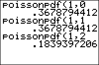

           
|Command Summary|Command Syntax|[Calculator Compatibility](compatibility.html)|[Token Size](tokens.html)|
|--- |--- |--- |--- |
|Calculates the Poisson probability for a single value|poissonpdf(*mean*, *value*)|TI-83/84/+/SE|2 bytes|

### Menu Location
Press:
1. 2ND DISTR to access the distribution menu
2. ALPHA B to select poissonpdf(, or use arrows.
Press ALPHA C instead of ALPHA B on a TI-84+/SE with OS 2.30 or higher.
       
# The poissonpdf( Command

This command is used to calculate Poisson distribution probability. In plainer language, it solves a specific type of often-encountered probability problem, that occurs under the following conditions:
1. A specific event happens at a known average rate (X occurrences per time interval)
2. Each occurrence is independent of the time since the last occurrence
3. We're interested in the probability that the event occurs a specific number of times in a given time.

The `poissonpdf(` command takes two arguments: The *mean* is the average number of times the event will happen during the time interval we're interested in. The *value* is the number of times we're interested in the event happening (so the output is the probability that the event happens *value* times in the interval).

For example, consider point on a city street where an average of 5 cars pass by each minute. What is the probability that in a given minute, 8 cars will drive by?

1. The event is a car passing by, which happens at an average rate of 5 occurrences per time interval (a minute)
2. Each occurrence is independent of the time since the last occurrence (we'll assume this is true, though traffic might imply a correlation here)
3. We're interested in the probability that the event occurs 8 times in the time interval

The syntax in this case is:
```
:poissonpdf(5,8
```
This will give about .065 when you run it, so there's a .065 probability that in a given minute, 8 cars will drive by.

## Formulas

The value of `poissonpdf(` is given by the formula

$$\operatorname{poissonpdf}(\lambda,k) = \frac{e^{-\lambda}\lambda^k}{k!}$$

## Related Commands

- [`binompdf(`](binompdf.html)
- [`binomcdf(`](binomcdf.html)
- [`poissoncdf(`](poissoncdf.html)
