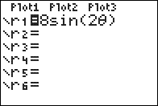

           
|Command Summary|Command Syntax|[Calculator Compatibility](compatibility.html)|[Token Size](tokens.html)|
|--- |--- |--- |--- |
|Enables polar graphing mode.|Polar|TI-83/84/+/SE|1 byte|

### Menu Location
While editing a program, press:
1. MODE to access the mode menu.
2. Use arrows to select Pol.
       
# The Polar Command

The Polar command enables the [polar](graphing-mode.html#polar) graphing mode.

Unlike the previous modes, polar mode doesn't use the more common (x,y) coordinates. Instead, the coordinates (r,θ) are used, where θ is the counterclockwise angle made with the positive x-axis, and r is the distance away from the origin (the point (0,0)). Although it's possible to translate from one system to the other, polar coordinates are more useful for some expressions (and, of course, less useful for others). 

In particular, they're very good at graphing anything circle-related. The equation for a circle in polar mode is just r=1 (or any other number, for a circle of different radius). 

Like in parametric mode, the parameter θ uses the window variables θmin, θmax, and θstep to determine which points are graphed. A common situation is θmin=0, θmax=2π: in [Radian](radian-mode.html) mode, this corresponds to going all the way around the circle. Of course, you could use [Degree](degree-mode.html) mode and set θmax to be 360, but this is uncommon in mathematics.

## Advanced Uses

The [window variables](system-variables.html#window) that apply to polar mode are:

- **θmin** — Determines the minimum θ-value graphed for equations.
- **θmax** — Determines the maximum θ-value graphed for equations.
- **θstep** — Determines the difference between consecutive θ-values.
- **Xmin** — Determines the minimum X-value shown on the screen.
- **Xmax** — Determines the maximum X-value shown on the screen.
- **Xscl** — Determines the horizontal space between marks on the X-axis in [AxesOn](axeson.html) mode or dots in [GridOn](gridon.html) mode.
- **Ymin** — Determines the minimum Y-value shown on the screen.
- **Ymax** — Determines the maximum Y-value shown on the screen.
- **Yscl** — Determines the vertical space between marks on the Y-axis in [AxesOn](axeson.html) mode or dots in [GridOn](gridon.html) mode.

## Related Commands

- [Func](func.html)
- [Param](param.html)
- [Seq](seq-mode.html)
