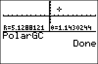

           
|Command Summary|Command Syntax|[Calculator Compatibility](compatibility.html)|[Token Size](tokens.html)|
|--- |--- |--- |--- |
|Sets the calculator to display point coordinates using polar coordinates.|PolarGC|TI-83/84/+/SE|2 bytes|

### Menu Location
Press: # 2nd FORMAT to access the graph format screen # Use arrows and ENTER to select PolarGC.
# The PolarGC Command

The PolarGC ("Polar Grid Coordinates") command (like its opposite, the [RectGC](rectgc.html)) command, affects how the coordinates of a point on the graph screen are displayed. When PolarGC is enabled, the coordinates of a point are displayed as (R,θ).

The polar coordinates of a point can be interpreted as the distance R it is away from the origin (0,0), and the direction θ. θ is the angle that a ray to the point would make with the positive X-axis (so polar coordinates are affected by [Degree](degree-mode.html)/[Radian](radian-mode.html) mode). An angle of 0 means the point is to the left of the origin; an angle of 90° (π/2 radians) means it's up from the origin, and so on. So, for example, the point with R=2 and θ=270° (3π/2 radians) would be two units down from the origin.

Of course, coordinates are only displayed with the [CoordOn](coordon.html) setting; however, with [CoordOff](coordoff.html), RectGC and PolarGC are still useful, because in a variety of cases, the coordinates of a point are also stored to variables. PolarGC doesn't change the fact that they're stored to X and Y, as with RectGC; however, with PolarGC, they are also stored to R and θ.

Although the PolarGC command naturally goes with [Polar](polar-mode.html) graphing mode, the two settings are independent; you can use both PolarGC and RectGC with any graphing mode.

## Advanced

The following situations involve storing coordinates of a point to variables:
- Graphing an equation
- Tracing an equation or plot
- Moving the cursor on the graph screen
- Using the interactive mode of one of the 2nd DRAW commands
- Using one of [DrawF](drawf.html), [DrawInv](drawinv.html), or [Tangent(](tangent.html)
- Anything in the 2nd CALC menu.

Naturally, any command like [Input](input.html) or [Select(](select.html) which involves the above, will also store coordinates of a point.

## Related Commands

- [PolarGC](polargc.html)
- [CoordOn](coordon.html)
- [CoordOff](coordoff.html)
