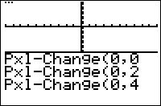

           
|Command Summary|Command Syntax|[Calculator Compatibility](compatibility.html)|[Token Size](tokens.html)|
|--- |--- |--- |--- |
|Toggles a pixel on the graph screen.|Pxl-Change(*row*,*column*)|TI-83/84/+/SE|1 byte|

### Menu Location
While editing a program press:
1. 2nd PRGM to enter the DRAW menu
2. RIGHT to enter the POINTS menu
3. 6 to choose Pxl-Change(, or use arrows
       
# The Pxl-Change( Command

The Pxl-Change( command is used to toggle the pixel at the given (Y,X) coordinates. If the pixel is on, it will be turned off and vice versa. Please note that the coordinates are switched around so that the row comes first and then the column — it's (Y,X) instead of (X,Y) like the [Pt-Change(](pt-change.html) command. Also note that the row decreases as you go *up* which can confuse users.

In addition to being easier to use because it is not affected by the window settings (meaning you don't have to set them when using the command), Pxl-Change( is faster than its equivalent Pt-Change( command, so it should generally be used instead whenever possible.

## Error Conditions

- **[ERR:DOMAIN](errors.html#domain)** is triggered if the coordinates are not whole numbers or not in the right range ([0..62] for row, [0..94] for column). These bounds are also affected by split screen mode.

## Related Commands

- [Pxl-On(](pxl-on.html)
- [Pxl-Off(](pxl-off.html)
- [pxl-Test(](pxl-test.html)
- [Pt-Change(](pt-change.html)
