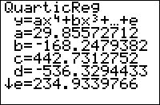

           
|Command Summary|Command Syntax|[Calculator Compatibility](compatibility.html)|[Token Size](tokens.html)|
|--- |--- |--- |--- |
|Calculates the best fit quartic equation through a set of points.|QuartReg [*x-list*, *y-list*, [*frequency list*], [*equation variable*]|TI-83/84/+/SE|1 byte|

### Menu Location
Press:<br># STAT to access the statistics menu<br># LEFT to access the CALC submenu<br># 7 to select QuartReg, or use arrows
# The QuartReg Command

The QuartReg command can calculate the best fit quartic equation through a set of points. To use it, you must first store the points to two lists: one of the x-coordinates and one of the y-coordinates, ordered so that the Nth element of one list matches up with the Nth element of the other list. L1 and L2 are the default lists to use, and the List Editor (STAT > Edit...) is a useful window for entering the points. You must have at least 5 points, because there's infinitely many quadratics that can go through 4 points or less

In its simplest form, QuartReg takes no arguments, and calculates a quartic through the points in L1 and L2:
```
:{9,13,21,30,31,31,34→L1
:{260,320,420,530,560,550,590→L2
:QuartReg
```

On the home screen, or as the last line of a program, this will display the equation of the quartic: you'll be shown the format, y=ax<sup>4</sup>+bx<sup>3</sup>+cx<sup>2</sup>+dx+e, and the values of a, b, c, d, and e. It will also be stored in the RegEQ variable, but you won't be able to use this variable in a program - accessing it just pastes the equation wherever your cursor was. Finally, the statistical variables a, b, c, d, e, and R<sup>2</sup> will be set as well. This latter variable will be displayed only if "Diagnostic Mode" is turned on (see [DiagnosticOn](diagnosticon.html) and [DiagnosticOff](diagnosticoff.html)).

You don't have to do the regression on L1 and L2, but if you don't you'll have to enter the names of the lists after the command. For example: 

```
:{9,13,21,30,31,31,34→FAT
:{260,320,420,530,560,550,590→CALS
:QuartReg ∟FAT,∟CALS
```

You can attach frequencies to points, for when a point occurs more than once, by supplying an additional argument - the frequency list. This list does not have to contain integer frequencies. If you add a frequency list, you must supply the names of the x-list and y-list as well, even when they're L1 and L2.

Finally, you can enter an equation variable (such as Y<sub>1</sub>) after the command, so that the quartic equation is stored to this variable automatically. This doesn't require you to supply the names of the lists, but if you do, the equation variable must come last. You can use polar, parametric, or sequential variables as well, but since the quadratic will be in terms of X anyway, this doesn't make much sense.

An example of QuartReg with all the optional arguments:

```
:{9,13,21,30,31,31,34→FAT
:{260,320,420,530,560,550,590→CALS
:{2,1,1,1,2,1,1→FREQ
:QuartReg ∟FAT,∟CALS,∟FREQ,Y1
```

## Advanced

Note that even if a relationship is actually linear, since a quartic regression has all the freedom of a linear regression and much more, it will produce a better R<sup>2</sup> value, especially if the number of points is small, and may lead you to (falsely) believe that a relationship is quartic when it actually isn't. An extreme example is the case of 5 points which are close to being on a line. The linear regression will be very good, but the quartic will seem even better - it will go through all 5 points and have an R<sup>2</sup> value of 1. However, this doesn't make the 5 points special - any 5 (that don't have repeating x-values) will do! Take the correlation constant with a grain of salt, and consider if the fit is really that much better at the expense of much added complexity, and if there's any reason to believe the relationship between the variables may be quartic. 

## Related Commands

- [LinReg(ax+b)](linreg(ax-b).html)
- [QuadReg](quadreg.html)
- [CubicReg](cubicreg.html)
