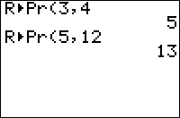

           
|Command Summary|Command Syntax|[Calculator Compatibility](compatibility.html)|[Token Size](tokens.html)|
|--- |--- |--- |--- |
|R►Pr( calculates the radius component (in polar coordinates) given the Cartesian coordinates.|R►Pr(*x*,*y*)|TI-83/84/+/SE|1 byte|

### Menu Location
Press:
1. 2nd ANGLE to access the angle menu.
2. 5 to select R►Pr(, or use arrows and ENTER.
       
# The R►Pr( Command

R►Pr( (Rectangular to polar radius) takes the (*x*,*y*)  (Cartesian) coordinates, and gives the radius coordinate *r* of the same point in (*r*,*θ*) (polar) mode. The identity used for this conversion is *r*² = *x*²+*y*²

```
R►Pr(3,4)
	5
√(3²+4²)
	5
R►Pr({6,5},{8,12})
	{10 13}
```

The function works even when the equivalent √(*x*²+*y*²) fails due to overflow:

```
R►Pr(3e99,4e99)
	5e99
```

## Optimization

R►Pr( is the smallest way to implement the distance formula $d=\sqrt{(x_1-x_2)^2+(y_1-y_2)^2}$. Just give the values x<sub>1</sub>-x<sub>2</sub> and y<sub>1</sub> - y<sub>2</sub> as arguments:

```
:√((5-2)²+(4-0)²)
can be
:R►Pr(5-2,4-0)
```

## Error Conditions

- **[ERR:DATA TYPE](errors.html#datatype)** is thrown if you input a complex argument.
- **[ERR:DIM MISMATCH](errors.html#dimmismatch)** is thrown if two list arguments have different dimensions.

## Related Commands

- [P►Rx(](p-rx.html)
- [P►Ry(](p-ry.html)
- [R►Pθ(](r-ptheta.html)
- [abs(](abs.html)
- [√(](square-root.html)
