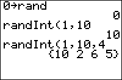

           
|Command Summary|Command Syntax|[Calculator Compatibility](compatibility.html)|[Token Size](tokens.html)|
|--- |--- |--- |--- |
|Generates a random integer between *min* and *max*, inclusive, or a list of such numbers.|randInt(*min*,*max*[,*# of numbers*])|TI-83/84/+/SE|2 bytes|

### Menu Location
Press:
1. MATH to access the [math](math.html) menu.
2. LEFT to access the PRB submenu.
3. 5 to select randInt(, or use arrows.
       
# The randInt( Command

randInt(*min*,*max*) generates a uniformly-distributed pseudorandom integer between *min* and *max* inclusive. randInt(*min*,*max*,*n*) generates a list of *n* uniformly-distributed pseudorandom integers between *min* and *max*.

*seed*→rand affects the output of randInt(.
```
0→rand
     0
randInt(1,10)
     10
randInt(1,10,5)
     {10 2 6 5 8}
```

## Optimization

When the lower bound of randInt( is 0, you can replace it with int(#rand to save space. For example:

```
:randInt(0,12
can be
:int(13rand
```

Similarly, if you don't want to include zero in the range, you can use a variant of 1-#int(#rand:

```
:1-2int(2rand
```

In this particular example, the only values that you will ever get are -1 or 1.

## Formulas

The value of randInt( for a given seed can be expressed in terms of [rand](rand.html):

randInt(A,B)=
- when A<B, A+int((B-A+1)rand
- otherwise, B+int((A-B+1)rand 

This is identical to the output of randInt( in the sense that for the same seed, both expressions will generate the same random numbers.

## Error Conditions

- **[ERR:DOMAIN](errors.html#domain)** is thrown if any of the arguments is a decimal.
- **[ERR: DATA TYPE](errors.html#datatype)** is given if you use imaginary numbers like 6i or something like Matrices or Lists. This error is used instead of ERR:DOMAIN for "i".
## Related Commands

- [rand](rand.html)
- [randBin(](randbin.html)
- [randNorm(](randnorm.html)
- [randM(](randm.html)
- [randIntNoRep(](randintnorep.html)
