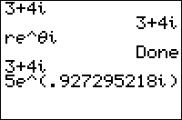

           
|Command Summary|Command Syntax|[Calculator Compatibility](compatibility.html)|[Token Size](tokens.html)|
|--- |--- |--- |--- |
|Puts the calculator into re^θ*i* mode.|re^θ*i*|TI-83/84/+/SE|1 byte|

### Menu Location
Press:
1. MODE to access the mode menu.
2. Use the arrow keys and ENTER to select re^θ*i*
       
# The re^θi Command

The re^θ*i* command puts the calculator into polar complex number mode. This means that:
- Taking square roots of negative numbers, and similar operations, no longer returns an error.
- Complex results are displayed in the form re^(θ*i*) (hence the name of the command)

The mathematical underpinning of this complex number format is due to the fact that if (x,y) is a point in the plane using the normal coordinates, it can also be represented using coordinates (r,θ) where r is the distance from the origin and θ is the angle that the line segment to the point from the origin makes to the positive x-axis (see [Polar](polar-mode.html) and [PolarGC](polargc.html) for more information on polar coordinates and graphing). What does this have to do with complex numbers? Simple: if x+y*i* is a complex number in normal (rectangular) form, and re^(θ*i*) is the same number in polar form, then (x,y) and (r,θ) represent the same point in the plane.

Of course, that has a lot to do with how you define imaginary exponents, which isn't that obvious.

An equivalent form to polar form is the form r[cos(θ)+*i*sin(θ)].

Unfortunately, the calculator seems to have some confusion about the use of [degree](degree-mode.html) and [radian](radian-mode.html) angle measures for θ in this mode (the answer is: you can only use radians — degrees make no sense with complex exponents). When calculating a value re^(θ*i*) by using the [e^(](e-exponent.html) command and plugging in numbers, the calculator assumes θ is a radian angle, whether it's in Degree or Radian mode. However, when *displaying* a complex number as re^(θ*i*), the calculator will display θ in radian or degree measure, whichever is enabled. This may lead to such pathological output as:
```
Degree:re^θi
		Done
e^(πi)
		1e^(180i)
Ans=e^(180i)
		0 (false)
```

It's recommended, then, to use [Radian](radian-mode.html) mode whenever you're in re^θ*i* mode.

## Related Commands

- [Real](real-mode.html)
- [a+bi](a-bi.html)
