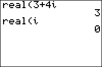

           
|Command Summary|Command Syntax|[Calculator Compatibility](compatibility.html)|[Token Size](tokens.html)|
|--- |--- |--- |--- |
|Returns the real part of a complex value.|real(*value*)|TI-83/84/+/SE|2 bytes|

### Menu Location
Press:<br># MATH to access the [math](math.html) menu.<br># RIGHT, RIGHT to access the CPX (complex) submenu.<br># 2 to select real(, or use arrows.
# The real( Command

real(*z*) returns the real part of the complex number *z*. If *z* is represented as *x*+i*y* where *x* and *y* are both real, real(*z*) returns *x*. Also works on a list of complex numbers.
```
real(3+4i)
     3
```

## Advanced Uses

The real( command is expanded by several [assembly libraries](asmlibs.html) (such as [xLIB](xlib.html) and [Omnicalc](omnicalc.html)) to call their own routines. If xLib is installed, then real( will no longer work as intended even in programs that want to use it for its intended purpose.

If you actually want to take the real part of a complex number, and want the program to work with one of these assembly libraries, you could use the [imag(](imag.html) command instead - real(Z) is equivalent to imag(Z*i*). Alternatively, you could tell people using your program to uninstall xLIB or Omnicalc first.

If a program you downloaded has an error and 2:Goto takes you to a line with real( and a bunch of arguments, this is probably because the program uses Omnicalc or xLIB which you don't have installed.

## Related Commands

- [abs(](abs.html)
- [angle(](angle.html)
- [conj(](conj.html)
- [imag(](imag.html)

## See Also

- [Assembly Libraries](asmlibs.html)
