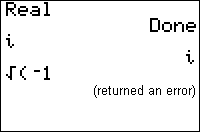

           
|Command Summary|Command Syntax|[Calculator Compatibility](compatibility.html)|[Token Size](tokens.html)|
|--- |--- |--- |--- |
|Enables real number only mode.|Real|TI-83/84/+/SE|1 byte|

### Menu Location
While editing a program, press:<br># MODE to access the mode menu.<br># Use arrows and ENTER to select Real.
# The Real Command

The Real command puts the calculator in real number-only mode. This shouldn't be taken quite literally, as you can still type in *i* to get complex numbers, and do operations with them (they will be displayed as in [a+bi](a-bi.html) mode, in that case). However, any operation done with **real** numbers that comes out to a complex result, such as taking the square root of a negative number, will throw a [ERR:NONREAL ANS](errors.html#nonrealans) error.

There is no real advantage to using Real mode over a+bi mode — it just adds another error condition that wouldn't be triggered otherwise. However, it is the default setting, and so there's a good chance that the calculator will be in Real mode when someone runs your program. Thus, when using complex numbers implicitly (such as in a quadratic equation solver) you should do something about this.

## Advanced Uses

Rather than switch to a+bi mode, you might want to force the calculations to use complex numbers by making the original argument complex. The general way to do this is by adding +0i to the number. However, there may be an optimization in any particular case. See the [quadratic formula](quadratic-formula.html) routine for a good example of this.

```
Real
		Done
√(-1)	
		(causes an error)
√(-1+0i)		
		i
```

## Related Commands

- [a+bi](a-bi.html)
- [re^θi](re-thetai.html)

## See Also

- [Quadratic Formula](quadratic-formula.html)
