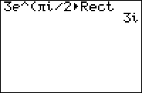

           
|Command Summary|Command Syntax|[Calculator Compatibility](compatibility.html)|[Token Size](tokens.html)|
|--- |--- |--- |--- |
|Formats a complex value in rectangular form when displaying it.|*value*►Rect|TI-83/84/+/SE|2 bytes|

### Menu Location
Press:
1. MATH to access the math menu.
2. RIGHT RIGHT to access the CPX submenu.
3. 6 to select ►Rect, or use arrows and ENTER.
       
# The ►Rect Command

The ►Rect command can be used when displaying a complex number on the home screen, or with the [Disp](disp.html) and [Pause](pause.html) commands. It will then format the number as though [a+bi](a-bi.html) mode were enabled, even when it's not. It also works with lists.

```
i►Polar
    1e^(1.570796327i)
Ans►Rect
    i
```

It will also work when displaying a number by putting it on the last line of a program by itself. It does **not** work with [Output(](output.html), [Text(](text.html), or any other more complicated display commands.

To actually separate a number into the components of rectangular form, use [real(](real-func.html) and [imag(](imag.html).

## Error Conditions

- **[ERR:SYNTAX](errors.html#syntax)** is thrown if the command is used somewhere other than the allowed display commands.
- **[ERR:DATA TYPE](errors.html#datatype)** is thrown if the value is real.

## Related Commands

- [►Frac](-frac.html)
- [►Dec](-dec.html)
- [►Polar](polar-display.html)
