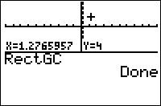

           
|Command Summary|Command Syntax|[Calculator Compatibility](compatibility.html)|[Token Size](tokens.html)|
|--- |--- |--- |--- |
|Sets the calculator to display point coordinates using rectangular (Cartesian) coordinates.|RectGC|TI-83/84/+/SE|2 bytes|

### Menu Location
Press:
1. 2nd FORMAT to access the graph format screen
1. Use arrows and ENTER to select RectGC.
       
# The RectGC Command

The RectGC ("Rectangular Grid Coordinates") command (like its opposite, the [PolarGC](polargc.html)) command, affects how the coordinates of a point on the graph screen are displayed. When RectGC is enabled, the coordinates of a point are displayed as (X,Y).

The X and Y coordinates of a point are interpreted as the horizontal and vertical distance from the origin (the point (0,0)) Up and right are positive directions, while down and left are negative. For example, the point (1,-2) — that is, the point with x-coordinate 1 and y-coordinate -2 — is one horizontal unit right and two horizontal units down from (0,0).

Of course, coordinates are only displayed with the [CoordOn](coordon.html) setting; however, with [CoordOff](coordoff.html), RectGC and PolarGC are still useful, because in a variety of cases, the coordinates of a point are also stored to variables. With RectGC enabled, they are stored to X and Y.

## Advanced

The following situations involve storing coordinates of a point to variables:
- Graphing an equation
- Tracing an equation or plot
- Moving the cursor on the graph screen
- Using the interactive mode of one of the 2nd DRAW commands
- Using one of [DrawF](drawf.html), [DrawInv](drawinv.html), or [Tangent(](tangent.html)
- Anything in the 2nd CALC menu.

Naturally, any command like [Input](input.html) or [Select(](select.html) which involves the above, will also store coordinates of a point.

## Related Commands

- [PolarGC](polargc.html)
- [CoordOn](coordon.html)
- [CoordOff](coordoff.html)
