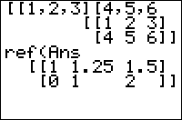

           
|Command Summary|Command Syntax|[Calculator Compatibility](compatibility.html)|[Token Size](tokens.html)|
|--- |--- |--- |--- |
|Puts a matrix into row-echelon form.|ref(*matrix*)|TI-83/84/+/SE|2 bytes|

### Menu Location
Press:
1. MATRX (on the TI-83) or 2nd MATRX (TI-83+ or higher) to access the matrix menu.
2. RIGHT to access the MATH submenu.
3. ALPHA A to select ref(, or use arrows.
       
# The ref( Command

Given a matrix with at least as many columns as it has rows, the `ref(` command uses a technique called Gaussian elimination to put the matrix into row-echelon form.

This means that the leftmost N columns (if the matrix has N rows) of the matrix are upper triangular - all entries below the main diagonal are zero. What's more, every entry on the main diagonal is either 0 or 1.

```
[[1,2,5,0][2,2,1,2][3,4,6,2]]
	[[1 2 5 0]
	 [2 2 1 2]
	 [3 4 6 2]
ref(Ans)►Frac
	[[1 4/3 2   2/3]
	 [0 1   9/2 -1 ]
	 [0 0   0   0  ]]
```

## Advanced Uses

In theory, a system of linear equations in N variables can be solved using the `ref(` command - an equation of the form $a_1x_1+\dots + a_nx_n = b$ becomes a row $a_1, \dots, a_n, b$, and is put into the matrix. If there is a sufficient number of conditions, the last row of the reduced matrix will give you the value of the last variable, and back-substitution will give you the others.

In practice, it's easier to use [`rref(`](rref.html) instead for the same purpose.

## Error Conditions

- **[ERR:INVALID DIM](errors.html#invaliddim)** is thrown if the matrix has more rows than columns.

## Related Commands

- [`rref(`](rref.html)
- [`rowSwap(`](rowswap.html)
- [`row+(`](rowplus.html)
- [`*row(`](timesrow.html)
- [`*row+(`](timesrowplus.html)
