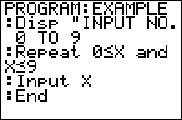

           
|Command Summary|Command Syntax|[Calculator Compatibility](compatibility.html)|[Token Size](tokens.html)|
|--- |--- |--- |--- |
|Loops through a block of code until the condition is true. Always loops at least once.|Repeat *condition*<br>*statement(s)*<br>End|TI-83/84/+/SE|1 byte|

### Menu Location
While editing a program press:
1. PRGM to enter the PRGM menu
1. 6 to choose Repeat, or use arrows
1. 7 to choose End, or use arrows
       
# The Repeat Command

A Repeat loop executes a block of commands between the Repeat and End commands until the specified condition is true. The condition is tested at the end of the loop (when the End command is encountered), so the loop will always be executed at least once. This means that you sometimes don't have to declare or initialize the variables in the condition before the loop.

After each time the Repeat loop is executed, the condition is checked to see if it is true. If it is true, then the loop is exited and program execution continues after the End command. If the condition is false, the loop is executed again.

## Advanced Uses

When using Repeat loops, you have to provide the code to break out of the loop (it isn't built into the loop). If there is no code that ends the loop, then you will have an infinite loop. An infinite loop just keeps executing, until you have to manually exit the loop (by pressing the ON key). In the case that you actually want an infinite loop, you can just use 0 as the condition. Because 0 is always false (based on Boolean Logic), the loop will never end.

```
:Repeat 0
:statement(s)
:End
```

Each time the program enters a Repeat block, the calculator uses 35+(size of the condition) bytes of memory to keep track of this. This memory is given back to you as soon as the program reaches End. This isn't really a problem unless you're low on RAM, or have a lot of nested Repeat statements. However, if you use [Goto](goto.html) to jump out of a Repeat block, you lose those bytes for as long as the program is running — and if you keep doing this, you might easily run out of memory, resulting in [ERR:MEMORY](errors.html#memory).

## Optimization

The [Ans](ans.html) variable (last answer) is a temporary variable that can hold any variable. Ans is changed when there is an expression or variable storage or when pausing with the [Pause](pause.html) command. It is mostly useful when you are just manipulating one variable. To use Ans just put an expression on a line by itself; it will automatically be stored to Ans. You can then change the expressions on the next line where the variable was called and put Ans there instead.

Because Repeat loops are executed at least once, you can sometimes put Ans in the condition instead of the variable.

```
:Repeat A
:getKey→A
:End
can be
:Repeat Ans
:getKey→A
:End
```

## Command Timings

When deciding whether to use a Repeat loop, as opposed to a For or While loop, it's good to know how Repeat loops stack up against them. This comparison comes from the [Code Timings](timings.html) page showing the speeds of the three different kinds of loops:

| Format | Bars | Pixels |
| --- | --- | --- |
| For(A,0,2000 
End | 4 bars + 4 pixels  | 36 |
| Delvar A 
While A≤2000 
A+1→A 
End | 23 bars  | 184 |
| Delvar A 
Repeat A>2000 
A+1→A 
End | 22 bars + 7 pixels | 183 |

The general conclusion you can take away from this table is that For( loops should be used when speed is a priority, and then you should use Repeat or While loops when the appropriate circumstance comes up. Each kind of loop has its own place, so it's still good to know how to use all three of them.

## Error Conditions

- **[ERR:INVALID](errors.html#invalid)** occurs if this statement is used outside a program.

## Related Commands

- [For(](for.html)
- [While](while.html)
- [If](if.html)
