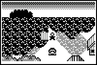

# Reuben Quest

|Program Summary|Program Size|Uses Libraries?|Calculator Compatibility|Author|Download|
| --- | --- | --- | --- | --- | --- |
|A quality RPG.|120KB (not including most of RAM for in game use)|Yes|TI-83+/84/+/SE  (Because of the size and complexity, this game is only recommended for those with a 83+SE, 84+, or 84+SE)|[Kevin Ouellet](http://www.ticalc.org/archives/files/authors/78/7864.html) (DJ Omnimaga)|[reubenquest.zip](http://tibasicdev.github.io/local--files/reuben-quest/reubenquest.zip)|

Reuben Question is a full-featured RPG, with a good storyline providing several hours of gameplay, flickerless grayscale graphics, complex puzzles, lots of monsters and plot twists, and many mini-games and side-quests.

Of course, none of this is cheap in the memory department. The game literally takes up over 120KB in archive, with it spread out to almost fifty different programs (in particular, each of the maps and bosses are given their own program), and you need to have several of them unarchived in order to actually play the game. Of course, this does not include the actual in game usages that occurs from using all of the real variables, lists, matrices, and strings.

Still, the game is a great achievement in TI-Basic, and surely stretches what people thought is possible.
