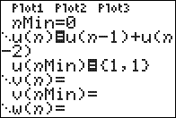

           
|Command Summary|Command Syntax|[Calculator Compatibility](compatibility.html)|[Token Size](tokens.html)|
|--- |--- |--- |--- |
|Enables sequence graphing mode.|Seq|TI-83/84/+/SE|1 byte|

### Menu Location
While editing a program, press:
1. MODE to access the mode menu.
2. Use arrows to select Seq.
       
# The Seq Command

The Seq command enables [sequence](graphing-mode.html#sequential) graphing mode.

Sequential mode is used for graphing sequences, which can be thought of as functions from the positive (or non-negative) integers. The TI-83 calculators let *n* be the independent variable in this situation, and the three sequences, instead of using subscripts, use the letters u, v, and w.

One of the main advantages of sequential mode is that it allows recursive definitions: u(*n*) can be defined in terms of u(*n*-1) and u(*n*-2). For recursive definitions to work, an initial case must be defined: this is done using the variables u(*n*Min), v(*n*Min), and w(*n*Min). The constant *n*Min is the initial case, for which the calculator will use a specific value rather than the formula.

For example, say a bunny population starts out at 100 and doubles each year. We can describe this situation using the recursive definition u(*n*)=2u(*n*-1) (this just says that the *n*th year population is twice the population of the previous year); then we set u(*n*Min)=100. Note that without u(*n*Min), the equation would be meaningless - without the initial population, we have no way to calculate any other population.

When you're using more than one previous value — both u(*n*-1) and u(*n*-2)) — you need more than one initial value, and then u(*n*Min) becomes a list.

## Advanced Uses

Sequence graphing mode has several submodes that can be selected from the 2nd FORMAT screen. They are [Time](time.html), [Web](web.html), [uvAxes](uvaxes.html), [uwAxes](uwaxes.html), and [vwAxes](vwaxes.html). Sequences are still defined in the same way, but these modes control the way that they're graphed.

The [window variables](system-variables.html#window) that apply to sequence mode are:

- ***n*Min** — Determines the minimum *n*-value calculated for equations.
- ***n*Max** — Determines the maximum *n*-value calculated for equations.
- **PlotStart** — Determines the first value of *n* that is actually graphed.
- **PlotStep** — Determines the difference between consecutive *graphed* values of *n*.
- **Xmin** — Determines the minimum X-value shown on the screen.
- **Xmax** — Determines the maximum X-value shown on the screen.
- **Xscl** — Determines the horizontal space between marks on the X-axis in [AxesOn](axeson.html) mode or dots in [GridOn](gridon.html) mode.
- **Ymin** — Determines the minimum Y-value shown on the screen.
- **Ymax** — Determines the maximum Y-value shown on the screen.
- **Yscl** — Determines the vertical space between marks on the Y-axis in [AxesOn](axeson.html) mode or dots in [GridOn](gridon.html) mode.

## Related Commands

- [Func](func.html)
- [Param](param.html)
- [Polar](polar-mode.html)
