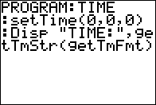

           
|Command Summary|Command Syntax|[Calculator Compatibility](compatibility.html)|[Token Size](tokens.html)|
|--- |--- |--- |--- |
|Sets the time of the clock on the TI-84+/SE.|setTime(*hour*,*minute*,*second*)|TI-84+/SE|2 bytes|

### Menu Location
This command can only be found in the catalog. Press:
1. 2nd CATALOG to enter the command catalog
2. s to skip to commands starting with S
3. Scroll down to setTime( and select it
       
# The setTime( Command

The setTime( command sets the time of the clock on the TI-84+/SE calculators. It takes three arguments: the hour, the minute, and the second. The hour must be in 24 hour format — where 13 is equal to 1 P.M. — and the minute and second need to be a valid number within the appropriate range (1-60). For example, this would set the time to 12:30:30:

```
:setTime(12,30,30
```

Once you have set the time, you can display it in two different formats on the [mode screen](settings.html) using the [setTmFmt(](settmfmt.html) command: 12 (12 hour) or 24 (24 hour). Of course, the time will only show up if the clock is on; if you need to turn the clock on, use the [ClockOn](clockon.html) command, or scroll down to the 'TURN CLOCK ON' message that is displayed in place of the clock on the mode screen and press ENTER twice.

## Related Commands

- [getTime](gettime.html)
- [getTmFmt](gettmfmt.html)
- [getTmStr(](gettmstr.html)
- [setTmFmt(](settmfmt.html)
