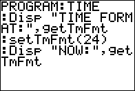

           
|Command Summary|Command Syntax|[Calculator Compatibility](compatibility.html)|[Token Size](tokens.html)|
|--- |--- |--- |--- |
|Sets the time format of the clock on the TI-84+/SE.|setTmFmt(*value*)|TI-84+/SE|2 bytes|

### Menu Location
This command can only be found in the catalog. Press:
1. 2nd CATALOG to enter the command catalog
1. s to skip to commands starting with S
1. Scroll down to setTmFmt( and select it
       
# The setTmFmt( Command

The setTmFmt( command sets the time format of the clock on the TI-84+/SE calculators when displaying the time on the [mode screen](settings.html). There are two different formats available, and you simply use the respective value (can be either a literal number or a variable) to display the desired one: 12 (12 hour) or 24 (24 hour). For example, this would set the time format to 24 hour:

```
:setTmFmt(24
```
  
In order for the time format to work, you need to set the time using either the [setTime(](settime.html) command, or by going into the set clock menu (accessible by pressing ENTER on the 'SET CLOCK' message that is displayed at the bottom of the mode screen). Of course, the time will only show up if the clock is on; if you need to turn the clock on, use the [ClockOn](clockon.html) command, or scroll down to the 'TURN CLOCK ON' message that is displayed in place of the clock on the mode screen and press ENTER twice.

## Related Commands

- [getTime](gettime.html)
- [setTime(](settime.html)
- [getTmFmt](gettmfmt.html)
- [getTmStr(](gettmstr.html)
