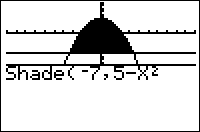

           
|Command Summary|Command Syntax|[Calculator Compatibility](compatibility.html)|[Token Size](tokens.html)|
|--- |--- |--- |--- |
|Graphs two functions and shades the area between them.|Shade(*lower func*, *upper func*, [*xmin*, *xmax*, *pattern #*, *resolution*])|TI-83/84/+/SE|1 byte|

### Menu Location
Press:
1. 2nd DRAW to access the draw menu.
2. 7 to select Shade(, or use arrows.
       
# The Shade( Command

The Shade( command draws two functions and shades the area between them.

Shade(*lower func*, *upper func*, [*xmin*, *xmax*, *pattern #*, *resolution*])

- *lowerfunc* and *upperfunc* are the two functions (whenever *lowerfunc*<*upperfunc*, the area between them will be shaded)
- *xmin* and *xmax* (optional) are left and right boundaries on where to shade.
- *pattern #* (optional) is an integer 1-4 determining which pattern to use:
 - 1 — vertical shading (default)
 - 2 — horizontal shading
 - 3 — diagonal shading (negative slope)
 - 4 — diagonal shading (positive slope)
- *resolution* (optional) is an integer 1-8 determining the spacing between shading lines. When it's 1 (default), everything is shaded, when it's 2, one pixel is skipped between lines, and so on - when it's 8, seven pixels are skipped.

Note that if you don't supply the *resolution* argument, it defaults to 1 and everything gets shaded regardless of the pattern.

## Advanced Uses

Shade(Ymin,Ymax) is the smallest (though not the fastest) way to shade the entire screen.

## Related Commands

- [DrawF](drawf.html)
- [DrawInv](drawinv.html)
- [Tangent(](tangent.html)

## See Also

- [Shading Circles](shading-circles.html)
