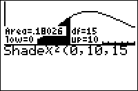

           
|Command Summary|Command Syntax|[Calculator Compatibility](compatibility.html)|[Token Size](tokens.html)|
|--- |--- |--- |--- |
|Finds the probability of an interval of the χ² distribution, and graphs this distribution with the interval's area shaded.|Shadeχ²(*lower*, *upper*, *df*)|TI-83/84/+/SE|2 bytes|

### Menu Location
Press:<br># 2ND DISTR to access the distribution menu<br># RIGHT to select the DRAW submenu<br># 3 to select Shadeχ²(, or use arrows
# The Shadeχ²( Command

`Shadeχ²(` is equivalent to [`χ²cdf(`](chisquarecdf.html) in terms of the probability it calculates: if a random variable follows the χ² distribution, you can use it to calculate the probability that the variable's value falls in a certain interval. However, in addition to calculating the probability, this command also draws the χ² curve, and shades the interval whose area represents the probability you want.

Note that this command does not actually return the value it calculates in Ans or anywhere else: it's merely displayed on the graph. If you're going to use the value in further calculations, you'll have to use `χ²cdf(` as well.

The `Shadeχ²(` command takes three arguments. *lower* and *upper* identify the interval you're interested in. *df* specifies the degrees of freedom (selecting from an infinite family of χ² distributions).

Thus, the following code would find the probability of χ² between 0 and 1 on a χ² distribution with 2 degrees of freedom, and shade this interval:

```
:Shadeχ²(0,1,2
```

## Advanced

Often, you want to find a "tail probability" - a special case for which the interval has no lower or no upper bound. For example, "what is the probability x is greater than 2?". The TI-83+ has no special symbol for infinity, but you can use `E99` to get a very large number that will work equally well in this case (`E` is the decimal exponent obtained by pressing [2nd] [EE]). Use `E99` for positive infinity, and `-E99` for negative infinity. 

It can be hard to find the best window for `Shadeχ²(` to work in, since it doesn't automatically zoom for you. For any number of degrees of freedom (except for 1), the graph doesn't go above y=.5 (a good value for [`Ymax`](system-variables.html#window)); [`Ymin`](system-variables.html#window) should probably be something small and negative. [`Xmin`](system-variables.html#window) should be around 0 (possibly slightly less if you like seeing axes), while [`Xmax`](system-variables.html#window) probably shouldn't go above 5.

Keep in mind that `Shadeχ²(` is just a drawing command and not an actual graphed function, so resizing the window, [`ClrDraw`](clrdraw.html), and other commands that refresh the [graphscreen](graphscreen.html) will remove it.

## Related Commands

- [`χ²pdf(`](chisquarepdf.html)
- [`χ²cdf(`](chisquarecdf.html)
- [`Shade(`](shade.html)
