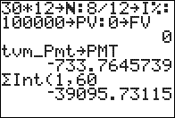

           
|Command Summary|Command Syntax|[Calculator Compatibility](compatibility.html)|[Token Size](tokens.html)|
|--- |--- |--- |--- |
|For an [amortization schedule](https://en.wikipedia.org/wiki/amortization_schedule), calculates the interest amount paid over a range of payments.|ΣInt(*paymentt1*, *payment2*, [*roundvalue*])|TI-83/84/+/SE|2 bytes|

### Menu Location
On the TI-83, press:
1. 2nd FINANCE to access the finance menu.
1. ALPHA A to select ΣInt(, or use arrows and ENTER.

On the TI-83+ or higher, press:
1. APPS to access the applications menu.
1. 1 or ENTER to select Finance...
1. ALPHA A to select ΣInt(, or use arrows and ENTER.
       
# The ΣInt( Command

The `ΣInt(` command calculates, for an [amortization schedule](https://en.wikipedia.org/wiki/amortization_schedule), the interest over a range of payments: the portion of those payments that went toward paying interest. Its two required arguments are *payment1* and *payment2*, which define the range of payments we're interested in. However, it also uses the values of the finance variables `PV`, `PMT`, and `I%` in its calculations.

The optional argument, *roundvalue*, is the number of digits to which the calculator will round all internal calculations. Since this rounding affects further steps, this isn't the same as using [`round(`](round.html) to round the result of `ΣInt(` to the same number of digits.

Usually, you will know the values of **N**, `PV`, and `I%`, but not `PMT`. This means you'll have to use the finance solver to solve for `PMT` before calculating `ΣInt(`; virtually always, `FV` will equal 0.

## Sample Problem

*Imagine that you have taken out a 30-year fixed-rate mortgage. The loan amount is $100000, and the annual interest rate (APR) is 8%. Payments will be made monthly. How much of the amount that was paid in the first five years went towards interest?*

We know the values of **N**, `I%`, and `PV`, though we still need to convert them to monthly values (since payments are made monthly). **N** is 30*12, and `I%` is 8/12. `PV` is just 100000.

Now, we use the finance solver to solve for `PMT`. Since you intend to pay out the entire loan, `FV` is 0. Using either the interactive TVM solver, or the [`tvm_Pmt`](tvm.html) command, we get a value of about -$733.76 for `PMT`.

We are ready to use `ΣInt(`. We are interested in the payments made during the first five years; that is, between the 1st payment and the 5*12=60th payment. `ΣInt(1,60)` gives us the answer: -$39095.73 (the negative sign simply indicates the direction of cash flow)

## Formulas

`ΣInt(` is calculated in terms of [`ΣPrn(`](sigmaprn.html), for which a recurrence exists. Since the total amount paid during an interval is known (it's the payment size, multiplied by the number of payments), we can subtract `ΣPrn(` from this total to get `ΣInt(`:

$$\operatorname{\Sigma Int}(n_1,n_2)=(n_2-n_1+1)\operatorname{PMT}-\operatorname{\Sigma Prn}(n_1,n_2)$$

## Error Conditions

- **[ERR:DOMAIN](errors.html#domain)** is thrown if either payment number is negative or a decimal.

## Related Commands

- [`bal(`](bal.html)
- [`ΣPrn(`](sigmaprn.html)
- [`tvm_Pmt`](tvm.html)
