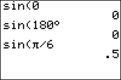

           
|Command Summary|Command Syntax|[Calculator Compatibility](compatibility.html)|[Token Size](tokens.html)|
|--- |--- |--- |--- |
|Returns the sine of a real number.|sin(*angle*)|TI-83/84/+/SE|1 byte|

### Menu Location
Press the SIN key to paste sin(.
       
# The sin( Command


> **NOTE**: Due to the limitations of the wiki markup language, the <sup>[r](wiki-limits.html#toc0)</sup> command on this page does not appear as it would on the calculator. See [Wiki Markup Limitations](wiki-limits.html) for more information.


sin(θ) returns the [sine](http://mathworld.wolfram.com/sine.html) of θ, which is defined as the y-value of the point of intersection of the unit circle and a line containing the origin that makes an angle θ with the positive x-axis

The value returned depends on whether the calculator is in [Radian](radian-mode.html) or [Degree](degree-mode.html) mode. A full rotation around a circle is 2π radians, which is equal to 360°.  The conversion from radians to degrees is angle*180/π and from degrees to radians is angle*π/180.  The sin( command also works on a list of real numbers.

In radians:
```
sin(π/6)
	.5
```

In degrees:
```
sin(30)
	.5
```


## Advanced Uses

You can bypass the mode setting by using the [°](degree-symbol.html) (degree) and <sup>[r](radian-symbol.html)</sup> (radian) symbols. These next two commands will return the same values no matter if your calculator is in degrees or radians:
```
sin(30°)
	.5
```
```
sin(π/6ֿ¹)
	.5
```

## Error Conditions

- **[ERR:DATA TYPE](errors.html#datatype)** is thrown if you supply a matrix or a complex argument.
- **[ERR:DOMAIN](errors.html#domain)** is thrown if you supply an input ≥1E12.

## Related Commands
- [sinֿ¹(](arcsin.html)
- [cos(](cos.html)
- [cosֿ¹(](arccos.html)
- [tan(](tan.html)
- [tanֿ¹(](arctan.html)

## See Also

- [Look-Up Tables](lookuptables.html)
