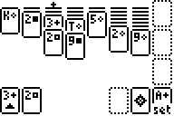

# Solitaire

|Program Summary|Program Size|Uses Libraries?|Calculator Compatibility|Author|Download|
| --- | --- | --- | --- | --- | --- |
|A quality version of the classic solitaire game.|3,993 bytes|No, it's pure TI-Basic|TI-83/84/+/SE|[nitacku](http://www.ticalc.org/archives/files/authors/90/9071.html)|[solitaire.zip](http://tibasicdev.github.io/local--files/solitaire/solitaire.zip)|

Solitaire is a card game that involves moving cards around, with the goal of making four stacks of cards (one per suit) in ascending order from Ace to King. The game features nice graphics, as well as good speed and size. The standard controls are used: arrow keys to move, CLEAR to quit, 2nd to select card, ALPHA to draw card, and GRAPH to set a card.
