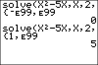

           
|Command Summary|Command Syntax|[Calculator Compatibility](compatibility.html)|[Token Size](tokens.html)|
|--- |--- |--- |--- |
|Attempts to return a real solution to the equation *expression*=0 for a specified single variable (other variables will be treated as constants), given a guess, and optionally bounds on the values of the variable.|solve(*expression*, *variable*, *guess*, [{*lower*, *upper*}])|TI-83/84/+/SE|1 byte|

### Menu Location
While editing a program, press:
1. MATH to go to the MATH menu.
2. 0 to choose solve(, or use arrows.

(outside the program editor, the interactive Solver will appear instead; use the Catalog to access the function directly)
       
# The solve( Command

The solve( command attempts to iteratively find a real root of a given equation, given the variable to solve for, and an initial guess; i.e., given *f*(*x*), solve( will attempt to find a value of *x* such that *f*(*x*)=0. solve( can take a list {*lower*,*upper*} as an optional fourth argument, in which case it attempts to find a root between *lower* and *upper* inclusive (by default, *lower* and *upper* are taken to be -E99 and E99 respectively). [Brent's method](http://mathworld.wolfram.com/brentsmethod.html) is used for finding the root.

Unfortunately, the solve( command (as with most iterative methods) is not perfect at solving equations. solve( will in general be unable to find "multiple roots", or can only find it to an accuracy less than the usual (an example would be the root *x*=1 of the equation (*x*-1)^*n*=0 for *n* greater than 1).  solve( will only return one of many possible roots to your equation if your equation has many roots to begin with. The root returned, in general, depends on the value of the guess given. The root returned is usually the root closest to the guess given for well-behaved equations; bad choices of the guess can cause solve( to either return a faraway root or not converge at all to a root.

If possible, the equation should first be solved by hand - if there is a relatively simple formula for the root, that will (usually) be more efficient than using solve(. Otherwise, ensure that the solve( call actually works in all the expected cases during use.

The Solver... utility (located in the same menu in the same place) is usually much easier and more intuitive to use, and is recommended instead of directly using solve( whenever applicable (e.g. the home screen). The same limitations apply to its efficiency. If you are unable to find roots using the Solver, try graphing the function and scanning for roots manually, then using 2:zero in the 2nd:CALC menu to refine your guess.

**Note**: Solver... changes the value of the variable being solved for to the root found; solve(, on the other hand, finds the root, but does not modify the original value of the variable.

## Advanced Uses

Reformulating an equation may be useful in certain instances. For example, the equations f(x)=0 and *e*<sup>*f*(*x*)</sup>=1 are equivalent. solve((X+1)<sup>2</sup>,X,0 returns ERR:NO SIGN CHG, while solve(*e*^((X+1)<sup>2</sup>)-1,X,0 returns -1.000000616 (pretty close to the root -1). Rearranging the equation may sometimes help as well.

Specifying bounds usually helps solve( to find roots more efficiently. If bounds are readily available, they should be supplied to solve(.

The error condition Bad Guess will occur if you use a string for the equation. There is a way around though. If you store the string into a function and use the function in place of the equation it will work.

```
Str1 → Y1
solve(Y1,X,0
```

## Error Conditions
- **[ERR:BAD GUESS](errors.html#badguess)** will be thrown if guess wasn't within the lower and upper bound, or else the function is undefined at that point, or if a string is used for an equation.

## Related Commands

- [fMax(](fmax.html)
- [fMin(](fmin.html)
- [fnInt(](fnint.html)
