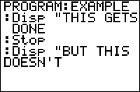

           
|Command Summary|Command Syntax|[Calculator Compatibility](compatibility.html)|[Token Size](tokens.html)|
|--- |--- |--- |--- |
|Completely stops the current program and any parent programs.|Stop|TI-83/84/+/SE|1 byte|

### Menu Location
While editing a program, press
1. PRGM to enter the program menu
2. ALPHA F to choose Stop, or use arrows
       
# The Stop Command

When the Stop command is used in a program it exits the program (terminating the program execution) and returns you to the home screen. If it is encountered within [loops](controlflow.html), the loops will be stopped.

There is some distinction when using Stop with [subprograms](subprograms.html): the Stop command will stop the program execution of the subprogram, as well as the calling program, and return you to the home screen; the program will stop completely. If this functionality is not desired, then you should use the [Return](return.html) command instead.

## Optimization

You don't have to put a Stop command at the end of a program or subprogram if you can organize the program so that it just naturally quits. When the calculator reaches the end of a program, it will automatically stop executing as if it had encountered a Stop command (the Stop is implied).

```
:ClrHome
:Input "Guess:",A
:Stop
Remove the Stop
:ClrHome
:Input "Guess:",A
```

## Error Conditions

- **[ERR:INVALID](errors.html#invalid)** occurs if this statement is used outside a program.

## Related Commands

- [prgm](prgm.html)
- [Return](return.html)

## See Also

- [Subprograms](subprograms.html)
