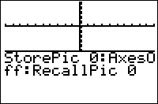

           
|Command Summary|Command Syntax|[Calculator Compatibility](compatibility.html)|[Token Size](tokens.html)|
|--- |--- |--- |--- |
|Stores the graph screen to a picture (one of Pic1, Pic2, ..., Pic0)|StorePic *number*|TI-83/84/+/SE|1 byte|

### Menu Location
Press: # 2nd DRAW to access the draw menu. # LEFT to access the STO submenu. # ENTER to select StorePic
# The StorePic Command

`StorePic` saves the graph screen to a picture (to recall it later, use `RecallPic`). Every detail of the graph screen will be stored as it appears, with the sole exception of X and Y labels on the axes (if they are shown).

The number passed to `StorePic` must be one of 0 through 9. It has to be a number: `StorePic X` will not work, even if X contains a value 0 through 9.

## Advanced Uses

A combination of `StorePic` and `RecallPic` can be used to maintain a background over which another [sprite](glossary.html#s) moves:

First, draw the background, and save it to a picture file with `StorePic`.
Next, draw the sprite to the screen.
When you want to move the sprite, erase it, then use `RecallPic` to draw the background again.
Then draw the sprite to its new location on the screen again (this can be done before or after using `RecallPic`).

Also, if a screen in your program takes more than a second to draw, and is displayed several times, you might want to consider storing it to a picture the first time it's drawn, and then recalling it every next time you want to draw it.

## Error Conditions

- **[ERR:DATA TYPE](errors.html#datatype)** is thrown if the argument is not a **number** 0 through 9.

## Related Commands

- [`ClrDraw`](clrdraw.html)
- [`RecallPic`](recallpic.html)
