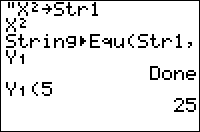

           
|Command Summary|Command Syntax|[Calculator Compatibility](compatibility.html)|[Token Size](tokens.html)|
|--- |--- |--- |--- |
|Stores the contents of a string to an equation variable.|String►Equ(*string*, *equation*|TI-83/84/+/SE|2 bytes|

### Menu Location
This command is found only in the catalog. Press:
1. 2nd CATALOG to access the catalog
1. T to skip to commands starting with T
1. Scroll up to String►Equ( and select it.
       
# The String►Equ( Command

This command stores the contents of a string  to an equation variable (such as Y<sub>1</sub> or X<sub>1T</sub>). This command can, in theory, be used whenever you need to set any equation variable.

In practice, however, this command is useless. This is because the [→](store.html) (store) operation can be used for the same purpose:
```
:String►Equ(Str1,Y1
can be
:Str1→Y1
```

This replacement is universal, takes the same time to run (because it actually uses the same routines), is more convenient to type since you don't have to go through the command catalog, and is two bytes smaller. 

## Advanced

Unlike any normal use of the → (store) operation, this situation is different because it doesn't modify [Ans](ans.html). For example:
```
:125
:"sin(X→Y1
:Disp Ans
```
Because this use of → does not modify Ans, '125' will be displayed rather than 'sin(X'. However, if we were to replace Y1 with Str1, then the → operation would work normally, and 'sin(X' would be displayed.

It's also important to realize the difference between the String►Equ( command and the related Equ►String(, aside from the fact that the latter is actually useful. The main difference is that while Equ►String('s arguments both have to be **variables**, String►Equ('s first argument can either be a variable (Str0 through Str9), a constant string (e.g., "sin(X)"), or an expression that returns a string (e.g., sub(Str1,1,5)). This applies to the → operation as well.

## Related Commands

- [Equ►String(](equ-string.html)
- [expr(](expr.html)
