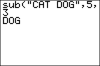

           
|Command Summary|Command Syntax|[Calculator Compatibility](compatibility.html)|[Token Size](tokens.html)|
|--- |--- |--- |--- |
|Returns a specific part of a given string, or divides by 100.|sub(*string*, *start*, *length*)<br><br>sub(*value*)|TI-83/84/+/SE<br><br>On TI83, the command is named soushc|2 bytes|

### Menu Location
This command can only be found in the catalog. Press:<br># 2nd CATALOG to enter the command catalog<br># T to skip to command starting with T<br># Scroll up to sub( and select it
# The sub( Command

The sub( command is used to get a substring, or a specific part of a string. It takes three arguments: *string* is the source string to get the substring from, *start* is the index of the token to start from, and *length* is the length of the substring you want. For example:
```
:sub("TI-BASIC",4,5
	"BASIC"
:sub("TI-BASIC",5,2
	"AS"
```

Keep in mind that you can't have an empty string, so the *length* argument can't be equal to 0. 

When the *length* argument is 1, sub(*string*,N,1 returns the Nth token in the string.

## Advanced Uses

If only one argument is given, and it contains an expression that evaluates to a real or complex number or list of numbers, the sub( command will divide the result by 100. 
```
:sub(225
    2.25
:sub({3+5i,-4i►Frac
    {3/100+1/20i,-1/25i}
```

Much like the use of the [%](percent.html) symbol, this is an undocumented feature that was introduced in OS version 1.15. Thus, care should be taken when using sub( in this way, as older versions will not support it.

----

Together with the [inString(](instring.html) command, sub( can be used to store a "list of strings" in a string, that you can then get each individual string from. To do this, think of a delimiter, such as a comma, to separate each individual string in the "list" (the delimiter must never occur in an individual string). The code will be simpler if the delimiter also occurs at the end of the string, as in "CAT,DOG,RAT,FISH,".

This routine will display each string in a "list of strings". You can adapt it to your own needs.
```
:1→I
:inString(Str1,",→J
:While Ans
:Disp sub(Str1,I,J-I
:J+1→I
:inString(Str1,",",Ans→J
:End
```

Alternatively, instead of using inString, you can start each individual string at the length of the longest string length, plus 1. If there are smaller strings that are not the same length, use spaces.

For example, if you wanted to display the suits for a card game, do the following:
```
:"SPADES--DIAMONDSHEARTS--CLUB----→Str1
:sub(Str1,1+8A,8
```
(Spaces have been replaced with dashes for visual clarity.)

Broken down, by manipulating A, different portions of the string can be displayed without the hassle of searching for characters. Setting A as 0 would display "SPADES—", but thanks to the spaces, the extra two characters would not be seen. A may be replaced with (A-1) if the 1st name would like to be displayed by setting A to 1.

This method is more preferable when using the Home Screen, as the spaces would wipe the last end characters of any previous strings displayed.

You can use this command as a number to character converter, too, as shown:

```
//Letter Number for Q
:17→Q
//Converter:
:sub("ABCDEFGHIJKLMNOPQRSTUVWXYZ",Q,1→Str1
:Disp Str1
```

## Error Conditions

- **[ERR:ARCHIVED](errors.html#archived)** is thrown if you try to take the substring of an archived string.
- **[ERR:DOMAIN](errors.html#domain)** is thrown if the starting and/or length value is less than 1, or if it is not an integer.
- **[ERR:INVALID DIM](errors.html#invaliddim)** is thrown if the starting and/or length value is beyond the length of the string.
- **[ERR:UNDEFINED](errors.html#undefined)** is thrown if you try to take the substring of a non-existent string.

## Related Commands

- [%](percent.html)
- [expr(](expr.html)
- [inString(](instring.html)
- [length(](length.html)
