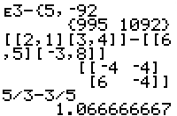

           
|Command Summary|Command Syntax|[Calculator Compatibility](compatibility.html)|[Token Size](tokens.html)|
|--- |--- |--- |--- |
|Returns the difference between two numbers.|*value1* - *value2*|TI-83/84/+/SE|1 byte|

### Menu Location
Press [-]
       
# The - Command

The - (subtract) operator takes two numbers, variables, or expressions and subtracts one from the other, thus returning the difference between them. The - operator appears lower in the order of operations than both [*](multiply.html) and [/](divide.html), so if those appear in an expression, they will be executed first. In addition,  the [+](add.html) operator has the same order of operations as -, so the calculator simply executes them left to right in the order that they appear.

```
:1-1
           0

:5→X
:2-3X
           -13

:2→A:3→B
:A/B-B/A
           -.8333333333
```

## Error Conditions

- **[ERR:SYNTAX](errors.html#syntax)** is thrown if you try to use - (subtract) in place of [‾](negative.html) (negative). Because they look very similar, it's easy to get this error; at the same time, it's an easy error to fix.

## Related Commands

- + ([add](add.html))
- * ([multiply](multiply.html))
- / ([divide](divide.html))
