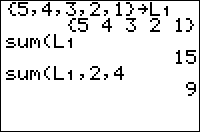

           
|Command Summary|Command Syntax|[Calculator Compatibility](compatibility.html)|[Token Size](tokens.html)|
|--- |--- |--- |--- |
|Calculates the sum of all or part of a list.|sum(*list*[,*start*,[*end*]])|TI-83/84/+/SE|1 byte|

### Menu Location
Press:
1. 2nd LIST to access the list menu.
1. LEFT to access the MATH submenu.
1. 5 to select sum(, or use arrows and ENTER.
       
# The sum( Command

The sum( command calculates the sum of all or part of a list. 

When you use it with only one argument, the list, it sums up all the elements of the list. You can also give it a bound of *start* and *end* and it will only sum up the elements starting and ending at those indices (inclusive).

```
sum({1,2,3,4,5})
	15
sum({1,2,3,4,5},2,4)
	9
sum({1,2,3,4,5},3)
	12
```

## Optimization

If the value of *end* is the last element of the list, it can be omitted: 
```
sum({1,2,3,4,5},3,5)
can be
sum({1,2,3,4,5},3)
```

## Error Conditions

- **[ERR:DOMAIN](errors.html#domain)** is thrown if the starting or ending value aren't positive integers.
- **[ERR:INVALID DIM](errors.html#invaliddim)** is thrown if the starting or ending value exceed the size of the list, or are in the wrong order.

## Related Commands

- [prod(](prod.html)
- [dim(](dim.html)
- [seq(](seq-list.html)
