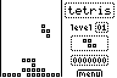

# Tetris

|Program Summary|Program Size|Uses Libraries?|Calculator Compatibility|Author|Download|
| --- | --- | --- | --- | --- | --- |
|A quality version of the classic tetris game.|2,877 bytes|No, it's pure TI-Basic|TI-83/84/+/SE|[nitacku](http://www.ticalc.org/archives/files/authors/90/9071.html)|[tetris.zip](http://tibasicdev.github.io/local--files/tetris/tetris.zip)|

Tetris is the smallest, fastest tetris clone programmed in TI-Basic. The game features quality graphics, increasing speed with each level, and a high score. The standard controls are used: left and right move a piece, down moves a piece down, and up rotates the piece.
