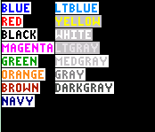

           
|Command Summary|Command Syntax|[Calculator Compatibility](compatibility.html)|[Token Size](tokens.html)|
|--- |--- |--- |--- |
|Defines the color of the text|TextColor(*color*<br>TextColor(*number*|TI-84+CSE and TI-84+CE|2 bytes|

### Menu Location
Press:
1. 2ND PRGM to enter the DRAW menu
1. A to select TextColor(, or use arrows
       
# The TextColor( Command

The `TextColor(` token is used to set the color for [`Text(`](text.html). Although the default color is Blue, the calculator saves the color until it is changed again using `TextColor(` or when a memory reset occurs. When a memory reset occurs, the text color is reset back to blue.

```
:TextColor(BLUE
:Text(0,0,"THIS TEXT IS BLUE
:TextColor(GRAY
:Text(12,0,"THIS TEXT IS GRAY
:Text(24,0,"THIS IS GRAY AS WELL
:TextColor(12
:Text(36,0,"THIS TEXT IS BLACK
```

The following table are the colors associated with their numeric values.

| Color Token | Numeric Value |
| --- | --- |
| BLUE | 10 |
| RED | 11 |
| BLACK | 12 |
| MAGENTA | 13 |
| GREEN | 14 |
| ORANGE | 15 |
| BROWN | 16 |
| NAVY | 17 |
| LTBLUE | 18 |
| YELLOW | 19 |
| WHITE | 20 |
| LTGRAY | 21 |
| MEDGRAY | 22 |
| GRAY | 23 |
| DARKGRAY | 24 |

Each color token is 2 bytes.
The color tokens can be used in calculations. For example, LTBLUE/3 will equal 6. 

## Background Colors

When the calculator displays text on the graphscreen, it displays it on top of a predetermined background color. This background color is white for all colors of text, except for yellow, white, and light gray (LTGRAY), which have a background color of medium gray (MEDGRAY). If you want to display text in your game without the annoying text-background, you need to have the graphscreen background be white or medium gray so the text-background doesn't show. The only known alternative is to use [`Pxl-On`](pxl-on.html) to draw the text manually, so how you work around this issue depends almost entirely on how lazy you are. You can see how this works by looking at the image in the Command Summary sidebar.

## Error Conditions

- **[ERR:DOMAIN](errors.html#domain)** is thrown if the argument specified is not an integer within the 10-24 range.

## Related Commands
- [`Text(`](text.html)
- [`Pxl-On`](pxl-on.html)
