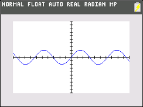

           
|Command Summary|Command Syntax|[Calculator Compatibility](compatibility.html)|[Token Size](tokens.html)|
|--- |--- |--- |--- |
|Sets all graphing lines to be 1 pixel wide.|This command is executed by itself with no additional arguments|TI-84+CSE/CE|2 bytes|

### Menu Location
Go to Catalog, press [ALPHA][4], and scroll down.
       
# The Thin Command


The Thin command will set all lines in the current function type to be only 1 pixel wide (hence "Thin"). The command can be run on the homescreen or within a program.

```
:AxesOff
:GridOff
:Thin
```

## Error Conditions

- **[ERR:SYNTAX](errors.html#syntax)** is thrown if additional arguments are put on the command.

## Related Commands

- [Thick](http://www.tibasicdev.github.io/thick)
