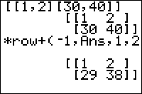

           
|Command Summary|Command Syntax|[Calculator Compatibility](compatibility.html)|[Token Size](tokens.html)|
|--- |--- |--- |--- |
|Adds a multiple of one row of a matrix to another.|*row+(*factor*,*matrix*,*row1*,*row2*)|TI-83/84/+/SE|1 byte|

### Menu Location
Press:
1. MATRX (on a TI-83) or 2nd MATRX (TI-83+ or higher) to access the matrix menu.
2. RIGHT to access the MATH submenu.
3. ALPHA F to select *row+(, or use arrows and ENTER.
       
# The *row+( Command

The *row+( adds a multiple of one row to another row and returns the result. It is an elementary row operation used in Gaussian Elimination. 

```
[[1,2][3,4]]
	[[1 2]
	 [3 4]]
*row+(10,Ans,1,2)
	[[3  4 ]
	 [31 42]]
```

## Advanced Uses

You can add columns instead of rows with the aid of the <sup>T</sup> ([transpose](transpose.html)) command.

## Error Conditions

- **[ERR:INVALID DIM](errors.html#invaliddim)** is thrown if one of the row arguments isn't a valid row (larger than the matrix size, or otherwise bad)

## Related Commands

- [rowSwap(](rowswap.html)
- [row+(](rowplus.html)
- [*row(](timesrow.html)
