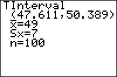

           
|Command Summary|Command Syntax|[Calculator Compatibility](compatibility.html)|[Token Size](tokens.html)|
|--- |--- |--- |--- |
|Using either already-calculated statistics, or a data set, computes a *t* confidence interval.|TInterval [*list*, [*frequency*]], [*confidence level*]<br>(data list input)<br><br>TInterval *mean*, *std. deviation*, *sample size*, [*confidence level*]<br>(summary stats input)|TI-83/84/+/SE/CSE/CE|2 bytes|

### Menu Location
When editing a program, press:
1. STAT to access the statistics menu
1. LEFT to access the TESTS submenu
1. 8 to select TInterval, or use arrows
(this key sequence will give you the TInterval... screen outside a program)
       
# The TInterval Command

The `TInterval` command calculates a confidence interval for the mean value of a population, at a specific confidence level: for example, if the confidence level is 95%, you are 95% certain that the mean lies within the interval you get. Use `TInterval` when you have a single variable to analyze, and **don't** know the standard deviation. The `TInterval` assumes that your distribution is normal, but it will work for other distributions if the sample size is large enough.

There are two ways to call the `TInterval` command: by supplying it with needed sample statistics (mean, sample standard deviation, and sample size), or by entering a list and letting the calculator work the statistics out. 

## Sample Problem

You want to know the average height of a student at your school. You haven't asked everyone, but you took a random sample of 30 people and found out their heights (and stored it to L<sub>1</sub>). You've decided to use a 95% confidence interval.

Since the syntax for entering a data list is `TInterval` *list*, *confidence level*, here is your code:
```
:TInterval L1,95
you can also use
:TInterval L1,.95
```

Alternatively, you could calculate the mean, sample size, and standard deviation, and enter those instead. The sample size is 30; let's say the mean was 63 inches and the standard deviation was 6.2 inches. 

The syntax for entering statistics is `TInterval` *mean*, *std. deviation*, *sample size*, *confidence level*, so your code would look like:
```
:TInterval 63,6.2,30,95
you can also use
:TInterval 63,6.2,30,.95
```

Of course, the main use of the `TInterval` command is in a program. While you can enter the `TInterval` command on the home screen as well (just look in the catalog for it), it would probably be easier to select `TInterval`... from the STAT>TEST menu (see the sidebar).

One thing to note about using `TInterval` in a program is that it will not display data if there are lines of code after it. Either the command is on the last line of code, or it will not display anything. The way to work around this is to display the lower and upper variables, as that is where TInterval stores the results.

```
:TInterval //some statistical data
:Disp lower,upper
```

## Advanced Uses

As with most other statistical commands, you can enter a second list after the data list, to add frequencies (only with the data list syntax, of course). The frequency list must contain non-negative integers, and can't be all 0.

## Optimization

Using the data list syntax, all the arguments are optional: the calculator will assume you want to use L<sub>1</sub> for your data unless another list is supplied, and that the confidence level you want is 95% unless you give another one. Using the summary stats syntax, the confidence level is also optional - again, the calculator will assume 95%. This means we can rewrite our code above in a simpler manner:

```
:TInterval L1,95
can be just
:TInterval
```
```
:TInterval 63,6.2,30,95
can be
:TInterval 63,6.2,30
```

## Error Conditions

- **[ERR:DATA TYPE](errors.html#datatype)** occurs if complex numbers are used (in some cases, **[ERR:ARGUMENT](errors.html#argument)** is thrown instead).
- **[ERR:DIM MISMATCH](errors.html#dimmismatch)** occurs if the data and frequency lists aren't the same size.
- **[ERR:DOMAIN](errors.html#domain)** occurs in any of the following cases:
 - The confidence level isn't in the range (0 .. 100).
 - The standard deviation isn't positive.
 - The sample size isn't an integer greater than 1.
- **[ERR:STAT](errors.html#stat)** occurs if the frequency list's elements aren't integers.

## Related Commands

- [`2-SampTInt`](2-samptint.html)
- [`ZInterval`](zinterval.html)
- [`2-SampZInt(`](2-sampzint.html)
