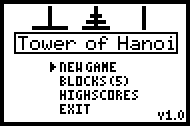

# Tower Of Hanoi

|Program Summary|Program Size|Uses Libraries?|Calculator Compatibility|Author|Download|
| --- | --- | --- | --- | --- | --- |
|A quality version of the classic tower of Hanoi game.|2,783 bytes|No, it's pure TI-Basic|TI-83/84/+/SE|[Martin Johansson](http://www.ticalc.org/archives/files/authors/35/3575.html) (Smoother)|[towerofhanoi.zip](http://tibasicdev.github.io/local--files/tower-of-hanoi/towerofhanoi.zip)|

The goal is to move all the blocks from one peg to another, and up to thirteen blocks can be changed by the player. A high score is saved for each level, which makes it a simple, but fun game.
