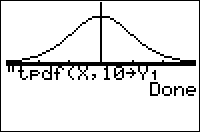

           
|Command Summary|Command Syntax|[Calculator Compatibility](compatibility.html)|[Token Size](tokens.html)|
|--- |--- |--- |--- |
|Evaluates the Student's *t* probability density function with degrees of freedom ν.|tpdf(*t*, *ν*)|TI-83/84/+/SE|2 bytes|

### Menu Location
Press:
1. 2ND DISTR to access the distribution menu
2. 4 to select tpdf(, or use arrows.
Press 5 instead of 4 on a TI-84+/SE with OS 2.30 or higher.
       
# The tpdf( Command

`tpdf(` is the Student's *t* probability density function. 

Since the *t* distribution is continuous, the value of `tpdf(` doesn't represent an actual probability — in fact, one of the few uses for this command is to draw a graph of the bell curve. You could also use it for various calculus purposes, such as finding inflection points. 

The command takes two arguments: the first is the value where the PDF is to be evaluated, and the second is the number of degrees of freedom (so the calculator knows which *t* distribution to use). As the degrees of freedom increases without bound, `tpdf(` approaches [`normalpdf(`](normalpdf.html); i.e.

$$\lim_{\nu\rightarrow\infty}\operatorname{tpdf}(x,\nu)=\operatorname{normalpdf}(x)$$

## Formulas

The value of `tpdf(` is given by

$$ \operatorname{tpdf}(t,\nu) = \frac{\Gamma((\nu+1)/2)}{\sqrt{\nu\pi}\,\Gamma(\nu/2)}\,\left(1+\frac{t^2}{\nu}\right)^{-\frac1{2}(\nu+1)} $$

(where Γ is the [gamma function](https://en.wikipedia.org/wiki/gamma_function)), or alternatively

$$ \operatorname{tpdf}(t,\nu) = \frac1{\sqrt{\nu}B(\nu/2,1/2)}\,\left(1+\frac{t^2}{\nu}\right)^{-\frac1{2}(\nu+1)} $$

(where B is the [beta function](https://en.wikipedia.org/wiki/beta_function))

## Related Commands

- [`tcdf(`](tcdf.html)
- [`invT(`](invt.html)
- [`Shade_t(`](shade_t.html)
