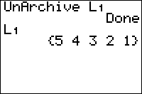

           
|Command Summary|Command Syntax|[Calculator Compatibility](compatibility.html)|[Token Size](tokens.html)|
|--- |--- |--- |--- |
|Moves a variable from the archive to RAM.|UnArchive *variable*|TI-83+/84+/SE  (not available on the regular TI-83)|2 bytes|

### Menu Location
Press:
1. 2nd MEM to access the memory menu
2. 6 to select UnArchive, or use arrows.
       
# The UnArchive Command

The UnArchive command moves a variable from the archive (also known as [ROM](glossary.html#R)) to [RAM](glossary.html#R). A quick synopsis of the difference between the two:
- Data in the archive cannot be accessed, but it's protected from RAM clears (which may occur during battery removal if not done carefully); also, the archive can hold much more data.
- Data in RAM can be accessed for calculations, but it can also be deleted during a RAM clear or accidentally overwritten by another program.

It is, in general, not recommended to place real variables in the archive (since so many programs use them); also, some variables cannot be archived (see the [Archive](archive.html) command for details). Although programs can be archived and unarchived, the Archive and UnArchive commands will not archive or unarchive programs from within a program. For the most part, [lists](lists.html) are the only type of variable it makes sense to archive and unarchive in a program.

The UnArchive command doesn't do anything if the variable in question is already in RAM. However, there is no way to test if a variable is in RAM or archive, short of trying to access it and potentially getting an error.

## Advanced Uses

The Archive and UnArchive commands can be used in conjunction for [saving](saving.html) data as a program exits.

## Optimization

The [SetUpEditor](setupeditor.html) command is often used in place of the UnArchive command when dealing with lists, for several reasons:
- using SetUpEditor will not prevent the program from working on a TI-83, like UnArchive will
- SetUpEditor will create a list with length 0 if it doesn't exist; UnArchive will throw an error
- SetUpEditor saves space in the program, since it can unarchive more than one list at a time, and doesn't require the little L in front

## Error Conditions

- **[ERR:MEMORY](errors.html#memory)** is thrown if there isn't enough memory available in RAM for the variable.
- **[ERR:VARIABLE](errors.html#variable)** is thrown when unarchiving a system variable or a application even if there is enough space.

## Related Commands

- [Archive](archive.html)
- [DelVar](delvar.html)
- [SetUpEditor](setupeditor.html)

## See Also

- [Saving Data](saving.html)
