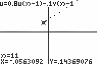

           
|Command Summary|Command Syntax|[Calculator Compatibility](compatibility.html)|[Token Size](tokens.html)|
|--- |--- |--- |--- |
|Sets the u and v sequence equations to be graphed against each other.|uvAxes|TI-83/84/+/SE|2 bytes|

### Menu Location
When [Seq](http://tibasicdev.github.io/seq-mode) mode is enabled, press: # 2nd FORMAT to access the format menu. # Use arrows to select uvAxes.
# The uvAxes Command

When uvAxes is enabled, and the calculator is in [Seq](seq-mode.html) mode, the equations u and v will be graphed against each other (that is, the points (u(*n*),v(*n*)) are graphed for the values of *n* between *n*Min and *n*Max). With this setting, sequence mode graphs are a bit like [parametric](param.html) mode, except the parameter *n* is always an integer, and recursive definitions are possible.

The equation w is ignored when in uvAxes mode.

See "Related Commands" for other possibilities of graphing sequences.

## Error Conditions

- **[ERR:INVALID](errors.html#invalid)** is thrown if either u or v is undefined.

## Related Commands

- [Time](time.html)
- [Web](web.html)
- [uwAxes](uwaxes.html)
- [vwAxes](vwaxes.html)
