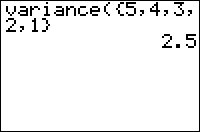

           
|Command Summary|Command Syntax|[Calculator Compatibility](compatibility.html)|[Token Size](tokens.html)|
|--- |--- |--- |--- |
|Finds the sample variance of a list.|variance(*list*,[*freqlist*])|TI-83/84/+/SE|1 byte|

### Menu Location
Press:<br># 2ND LIST to enter the LIST menu.<br># LEFT to enter the MATH submenu.<br># 8 to select variance(, or use arrows.
# The variance( Command

The `variance(` command finds the sample variance of a list, a measure of the spread of a distribution. It takes a list of real numbers as a parameter. For example:

```
:Prompt L1
:Disp "VARIANCE OF L1",variance(L1
```

## Advanced Uses

Frequency lists don't need to be whole numbers; your calculator can handle being told that one element of the list occurs 1/3 of a time, and another occurs 22.7 times. It can even handle a frequency of 0 - it will just ignore that element, as though it weren't there.

## Formulas

The formula for variance used by this command is:

$$ s_n^2 = \frac{1}{N-1} \sum_{i=1}^N (x_i - \overline{x})^2 $$

This is the formula for sample variance. The formula for population variance, which this command does **not** use, varies slightly:

$$ \sigma^2 = \frac{1}{N} \sum_{i=1}^N (x_i - \overline{x})^2 $$

If the population variance is required, just multiply the result of `variance()` by $1-1/N$.

With frequencies *w<sub>i</sub>*, the formula becomes

$$ s_n^2 = \frac{\sum_{i=1}^N w_i(x_i - \overline{x})^2}{\sum_{i=1}^N (w_i)-1} $$

where $\overline{x}$ is the mean with frequencies included.

## Related Commands

- [`mean(`](mean.html)
- [`median(`](median.html)
- [`stdDev(`](stddev.html)
