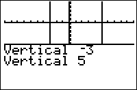

           
|Command Summary|Command Syntax|[Calculator Compatibility](compatibility.html)|[Token Size](tokens.html)|
|--- |--- |--- |--- |
|Draws a vertical line on the graph screen.|Vertical *X*|TI-83/84/+/SE/C/CSE|1 byte|

### Menu Location
In the program editor:
1. 2nd DRAW to enter the draw menu.
2. 4 to insert the Vertical command, or use arrows and ENTER.
       
# The Vertical Command

Vertical *X* draws a vertical line from the top of the graph screen to the bottom at *X*. Vertical is usually only used to replace a line that stretches the entire length of the graph screen, along with its counterpart [Horizontal](horizontal.html).

Vertical is affected by the window settings, unlike the [Pxl-](pxl-on.html) commands.

```
:Vertical 5
```

## Uses on TI 84+C Version Calculators

The Vertical command takes an additional color argument for TI 84+C version calculators, as shown below:

```
Vertical 5,BLACK
```

## Related Commands

- [Line(](line.html)
- [Horizontal](horizontal.html)
