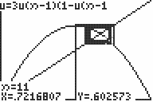

           
|Command Summary|Command Syntax|[Calculator Compatibility](compatibility.html)|[Token Size](tokens.html)|
|--- |--- |--- |--- |
|Sets sequence equations to be graphed as web diagrams.|Web|TI-83/84/+/SE|2 bytes|

### Menu Location
While in [Seq](http://tibasicdev.github.io/seq-mode) mode, press:
1. 2nd FORMAT to access the format menu.
1. Use arrows and ENTER to select Web.
       
# The Web Command

In Web mode, sequence equations are graphed as [web diagrams](http://mathworld.wolfram.com/webdiagram.html). This is a way of visualizing iterations of a function (that is, the sequence n, f(n), f(f(n)), f(f(f(n))), ... for some function f and starting value n). For this mode to properly work, each sequence equation should be in terms of its previous value only: u(*n*) should be a function of u(*n*-1). Referencing other sequence equations, or u(*n*-2), will yield [ERR:INVALID](errors.html#invalid); referencing the value *n* is allowed by the calculator, but makes the result meaningless so you should avoid it.

When you go to the graph screen, the associated function y=f(x) will be graphed. That is, if you define u(*n*) = cos(u(*n*-1)), the function y=cos(x) will be graphed. If you have [AxesOn](axeson.html) enabled, the line y=x will also be graphed. It's easy to see that the intersection points of the graphs y=f(x) and the line y=x represent the fixed points (points such that f(x)=x) of the function.

The web diagram itself will be drawn if you press TRACE or use the [Trace](trace.html) command. First you will choose the equation (u, v, or w) to trace; then, by pressing RIGHT repeatedly, the web will be drawn, starting from the initial value *n*Min. In a web diagram, a point (n, f(n)) on the graph of y=f(x) is connected by a horizontal segment to the point (f(n), f(n)) on the graph of y=x, and then by a vertical segment to the point (f(n), f(f(n))) on the graph of y=f(x) again; this process is repeated. Each pair of a horizontal and vertical segment represents an added iteration of.

Web diagrams can be used to look at the attracting behavior of fixed points. For example:

1. Graph the equation u(*n*)=cos(u(*n*-1)), u(*n*Min)=1 in Web mode, with Xmin=0, Xmax=1, Ymin=0, Ymax=1 in the WINDOW menu. You'll see that it has a single fixed point. If you TRACE the graph, the line segments will spiral around into the fixed point, so appears to be attractive.

2. Graph the equation u(*n*)=π/2cos(u(*n*-1)), u(*n*Min)=1 in Web mode, with Xmin=0, Xmax=π/2, Ymin=0, Ymax=π/2 in the WINDOW menu. This equation looks a lot like the previous one, and also has a single fixed point. However, if you TRACE the graph, the line segments (which start out quite close to the fixed point) will spiral away from it. This intuitively shows that the fixed point of f(x)=π/2cos(x) is not attractive.

See "Related Commands" for other possibilities of graphing sequences.

## Error Conditions

- **[ERR:INVALID](errors.html#invalid)** is thrown if an equation being graphed references other sequence equations or the *n*-2 term.

## Related Commands

- [Time](time.html)
- [uvAxes](uvaxes.html)
- [uwAxes](uwaxes.html)
- [vwAxes](vwaxes.html)
