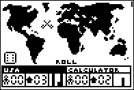

# World Domination

|Program Summary|Program Size|Uses Libraries?|Calculator Compatibility|Author|Download|
| --- | --- | --- | --- | --- | --- |
|A quality version of the classic risk game.|10KB|No, it's pure TI-Basic|TI-83/84/+/SE|[Kerm Martian](http://www.cemetech.net/)|[worlddomination.zip](http://tibasicdev.github.io/local--files/world-domination/worlddomination.zip)|

World Domination is a real-time strategy game based on games such as Risk; you battle the calculator AI for control of the world. Each player starts with several units to place around the map of the world, then take turns moving, attacking, and redeploying. If you or the calculator gains control of a continent, you get a number of bonus units. Defeat all enemy troops to win the game.
