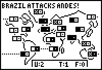

# World Empire

|Program Summary|Program Size|Uses Libraries?|Calculator Compatibility|Author|Download|
| --- | --- | --- | --- | --- | --- |
|A quality version of the classic risk game.|5,717 bytes|No, it's pure TI-Basic|TI-83/84/+/SE|[Arthur O'Dwyer](http://www.club.cc.cmu.edu/-ajo/)|[worldempire.zip](http://tibasicdev.github.io/local--files/world-empire/worldempire.zip)|

World Empire is a two-player, Risk-style war game against a computer opponent. The goal of the game is to defeat the computer ("Hal") by conquering all of its nations, leaving it with no way to raise an army. If Hal succeeds in conquering all your nations, on the other hand, then Hal wins and you lose.

The map of the world is divided into 20 nations, each of which has two basic characteristics: its current owner and its underlying sympathies. In addition, each nation has one fundamental, immutable characteristic: its productivity, or "value." A nation's value represents how many troops it can produce per turn. For example, China's value is 5, while Greenland's value is only 1. Each nation also has up to four neighbors, with which it can fight or transfer troops.
