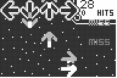

# Xlib Xlib Revolution

|Program Summary|Program Size|Uses Libraries?|Calculator Compatibility|Author|Download|
| --- | --- | --- | --- | --- | --- |
|A quality DDR clone.|30KB|Yes, [xLIB](http://tibasicdev.github.io/xlib)|TI-83+/84/+/SE|[Kevin Ouellet](http://www.ticalc.org/archives/files/authors/78/7864.html) (DJ Omnimaga)|[xlibxlibrevolution.zip](http://tibasicdev.github.io/local--files/xlib-xlib-revolution/xlibxlibrevolution.zip)|

xLIB xLIB Revolution is a clone of the Dance Dance Revolution game using the xLIB Flash app. Unlike most other calculator clones, this one features quality graphics and runs pretty fast. It also includes a level editor that will allow infinite possibilities for the game. You can even have background images in songs and animations. This is one of the best TI-Basic DDR clones available.
