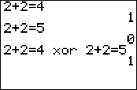

           
|Command Summary|Command Syntax|[Calculator Compatibility](compatibility.html)|[Token Size](tokens.html)|
|--- |--- |--- |--- |
|Returns the truth value of *value1* or *value2*, but not both, being true.|*value1* xor *value2*|TI-83/84/+/SE|1 byte|

### Menu Location
Press:
1. 2nd TEST to access the test menu.
1. RIGHT to access the LOGIC submenu.
1. 3 to select xor, or use arrows and ENTER.
       
# The xor Command

The third and final [binary](binandhex.html) operator is a little trickier, but it has the coolest name.  **xor** takes two numbers of expressions and checks to see if *exactly one* is True.  If both are True or both are False, it returns 0.
```
1 xor 0
           1

:2 xor (3 xor 0)    (after evaluating 3 xor 0, it simplifies into True xor True.)
           0

:0 xor (1-1)^2
           0
```
### Table of Results
For reference, the following true/false table shows what gets returned when you use different combinations of 1 (true) and 0 (false):

| xor | 1 (true) | 0 (false) |
| --- | --- | --- |
| 1 (true) | 0 (false) | 1 (true) |
| --- | --- | --- |
| 0 (false) | 1 (true) | 0 (false) |
| --- | --- | --- |

## Related Commands

- [and](and.html)
- [or](or.html)
- [not(](not.html)
