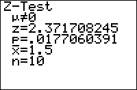

           
|Command Summary|Command Syntax|[Calculator Compatibility](compatibility.html)|[Token Size](tokens.html)|
|--- |--- |--- |--- |
|Performs a *z* significance test.|Z-Test(*μ<sub>0</sub>*, *σ*, [*list*, *frequency*, *alternative*, *draw?*]<br>(data list input)<br><br>Z-Test(*μ<sub>0</sub>*, *σ*, *sample mean*, *sample size*, [*alternative*, *draw?*]<br>(summary stats input)|TI-83/84/+/SE|2 bytes|

### Menu Location
While editing a program, press:
1. STAT to access the statistics menu
1. LEFT to access the TESTS submenu
1. ENTER to select Z-Test(
(outside the program editor, this will select the Z-Test... interactive solver)
       
# The Z-Test( Command

Z-Test( performs a *z* significance test of a null hypothesis you supply. This test is valid for simple random samples from a population with a known standard deviation. In addition, either the population must be normally distributed, or the sample size has to be sufficiently large.

The logic behind a Z-Test is as follows: we want to test the hypothesis that the true mean of a population is a certain value (*μ<sub>0</sub>*). To do this, we assume that this "null hypothesis" is true, and calculate the probability that the variation from this mean occurred, under this assumption. If this probability is sufficiently low (usually, 5% is the cutoff point), we conclude that since it's so unlikely that the data could have occurred under the null hypothesis, the null hypothesis must be false, and therefore the true mean *μ* is not equal to *μ<sub>0</sub>*. If, on the other hand, the probability is not too low, we conclude that the data may well have occurred under the null hypothesis, and therefore there's no reason to reject it.

In addition to the null hypothesis, we must have an alternative hypothesis as well - usually this is simply that the true mean is **not** *μ<sub>0</sub>*. However, in certain cases when we have reason to suspect the true mean is less than or greater than *μ<sub>0</sub>*, we might use a "one-sided" alternative hypothesis, which will state that the true mean *μ*<*μ<sub>0</sub>* or that *μ*>*μ<sub>0</sub>*.

As for the Z-Test( command itself, there are two ways of calling it: you may give it a list of all the sample data, or the necessary statistics about the list - its size, and the mean. In either case, you can indicate what the alternate hypothesis is, by a value of 0, -1, or 1 for the *alternative* argument. 0 indicates a two-sided hypothesis of *μ*≠*μ<sub>0</sub>*, -1 indicates *μ*<*μ<sub>0</sub>*, and 1 indicates *μ*>*μ<sub>0</sub>*.

Although you can access the Z-Test( command on the home screen, via the catalog, there's no need: the Z-Test... interactive solver, found in the statistics menu, is much more intuitive to use - you don't have to memorize the syntax.

In either case, it's important to understand the output of Z-Test. Here are the meanings of each line:

- The first line, involving μ, is the alternative hypothesis.
- z is the test statistic, the standardized difference between the sample mean and *μ<sub>0</sub>*. If the null hypothesis is true, it should be close to 0.
- p is the probability that the difference between the sample mean and *μ<sub>0</sub>* would occur if the null hypothesis is true. When the value is sufficiently small, we reject the null hypothesis and conclude that the alternative hypothesis is true. You should have a cutoff value ready, such as 5% or 1%. If p is lower, you "reject the null hypothesis on a 5% (or 1%) level" in technical terms.
- x-bar is the sample mean.
- Sx is the sample standard deviation. This isn't actually used in any calculations, and will only be shown for data list input.
- n is the sample size.

## Sample Problem

According to M&M's advertising, each standard-size bag of M&M's contains an average of 10 blue M&M's with a standard deviation of 2 M&M's. You think that this estimate is low, and that the true average is higher. You decide to test this hypothesis by buying thirty bags of M&M's. You count the number of blue M&M's in each, and store this number to L1.

The value of *μ<sub>0</sub>* is 10, because you want to test the null hypothesis that there are on average 10 blue M&M's per bag. The value of *σ* is 2. We want to test the values in L1. Because we want to test if there's actually more than 10 blue M&M's per bag, we have a one-sided alternate hypothesis: *μ*>*μ<sub>0</sub>*, which corresponds to an argument of 1. To solve the problem, you'd use this code:
```
:Z-Test(10,2,L1,1
```

Alternatively, you could calculate the mean and sample size of your sample, and put those into the command instead. The sample size is 30; let's suppose that the mean was 11.2. The code you'd use is:
```
:Z-Test(10,2,11.2,30,1
```

You will see the following output:
```
Z-Test
 μ>10
 z=3.286335345
 p=5.0755973e-4
 x=11.2
 n=30
```

The most important part of this output is "p=5.0755973e-4". This value of p is much smaller than 1% or 0.01; it's in fact around 0.0005. This is significant on the 1% level, so we reject the null hypothesis and conclude that the alternative hypothesis is true: μ>10, that is, the average number of blue M&M's in a bag is more than 10.

## Advanced Uses

The final argument of Z-Test(, *draw?*, will display the results in a graphical manner if you put in "1" for it. The calculator will draw the **standard** normal curve, and shade the area of the graph beyound the z statistic. In addition, the value of z and the value of p will be displayed (the value of p corresponds to the shaded area). You would make your conclusions in the same way as for the regular output.

As with most other statistical commands, you may use a frequency list in your input (when using the data list syntax).

## Optimization

Most of the arguments of the Z-Test( command have default values, and the argument can be omitted if this value is accepted.

- The *draw?* argument can be omitted if you don't want graphical output, although you could put "0" in as well.
- If the *draw?* argument is omitted, you can omit the *alternative* argument to use a two-sided test (*μ*≠*μ<sub>0</sub>*). If you include the *draw?* argument, you have to include this - otherwise there will be confusion as to what the 5th argument means.
- With data list input, you can always omit the frequency list if you won't be using it.
- With data list input, if the *draw?* and *alternative* arguments are omitted, and your data is in L1, you may omit L1 as well. However, if *alternative* or *draw?* is present, you have to include it, or else the syntax may be confused with the syntax for summary stats input.

The code in the sample problem above can't be optimized, because the *alternative* argument is 1:
```
::Z-Test(10,2,L1,1
```

However, if we were doing a two-sided test, we could omit the *alternative* and the *list* arguments (since we're testing L1):
```
:Z-Test(10,2,L1,0
can be
:Z-Test(10,2
```

## Related Commands

- [2-SampZTest(](2-sampztest.html)
- [T-Test](t-test.html)
- [2-SampTTest](2-sampttest.html)
