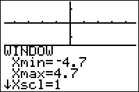

           
|Command Summary|Command Syntax|[Calculator Compatibility](compatibility.html)|[Token Size](tokens.html)|
|--- |--- |--- |--- |
|Zooms to a [friendly window](friendly-window.html) where all pixels have simple coordinates.|ZDecimal|TI-83/84/+/SE|1 byte|

### Menu Location
Press:
1. ZOOM to access the zoom menu.
1. 4 to select ZDecimal, or use arrows and ENTER.
       
# The ZDecimal Command

The `ZDecimal` command makes the following changes to the [window variables](system-variables.html#window):
- Xmin=-4.7
- Xmax=4.7
- Xscl=1
- Ymin=-3.1
- Ymax=3.1
- Yscl=1

If using a TI-84+CSE or CE, the window variables become:
- Xmin=-6.6
- Xmax=6.6
- Xscl=1
- Ymin=-4.1
- Ymax=4.1
- Yscl=1

Because of the dimensions of the graph screen, this has the useful effect that every pixel has round X- and Y-coordinates with at most one decimal digit. Also, the screen has correct proportions: a specific distance in the X direction is the same number of pixels in length as the same distance in the Y direction. This makes the window dimensions created by `ZDecimal` a [friendly window](friendly-window.html) (the [`ZInteger`](zinteger.html) and [`ZSquare`](zsquare.html) commands also have this effect, but in slightly different ways)

## Advanced Uses

Using the `ZDecimal` command prevents gaps in certain graphs, and makes sure vertical asymptotes with integer coordinates are graphed correctly. Also, circles will be drawn as actual circles with this graphing window(unlike other windows, with which they might appear stretched).

The values given for `Xmin`, `Xmax`, etc. above are only correct for the [`Full`](full.html) mode setting (which is the default, and the most common setting). In [`Horiz`](horiz.html) and [`G-T`](g-t.html) modes, the values will be different, preserving the property that two pixels next to each other differ in coordinates by 0.1:
- Ymin= -1.5 and Ymax= 1.5 in `Horiz` mode (Xmin and Xmax are the same)
- Ymin= -2.5 and Ymax= 2.5 in `G-T` mode, while Xmin= -2.3 and Xmax= 2.3

## Error Conditions

- **[ERR:INVALID](errors.html#invalid)** occurs if this command is used outside a program.

## Related Commands

- [`ZInteger`](zinteger.html)
- [`ZSquare`](zsquare.html)
- [`ZStandard`](zstandard.html)

## See Also

- [Friendly Graphing Windows](friendly-window.html)
