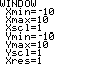

           
|Command Summary|Command Syntax|[Calculator Compatibility](compatibility.html)|[Token Size](tokens.html)|
|--- |--- |--- |--- |
|Restores the basic window settings as they were before the last zoom command.|ZPrevious|TI-83/84/+/SE|1 byte|

### Menu Location
Press:
1. ZOOM to access the zoom menu.
2. RIGHT to access the MEMORY submenu.
3. ENTER or 1 to select ZPrevious.
       
# The ZPrevious Command

The ZPrevious command (and menu option) restore the [window variables](system-variables.html#window) Xmin, Xmax, Xscl, Ymin, Ymax, and Yscl to the values they had before the last [zoom](zoom.html) command. This means, of course, that using ZPrevious a second time will cancel its effects.

Since no variables that are specific to the current graphing mode are changed, ZPrevious doesn't always achieve the effect of reversing the previous zoom command. For example, in [Polar](polar-mode.html) graphing mode, [ZStandard](zstandard.html) will set θmin and θmax to 0 and 2π respectively. However, even if they were different before ZStandard, ZPrevious will not restore these settings. Also, ZPrevious doesn't notice if you change the window settings directly (by storing to the window variables).

Unlike [ZoomSto](zoomsto.html) and [ZoomRcl](zoomrcl.html), the values that ZPrevious uses aren't made available in any sort of variable.

## Optimization

Using [StoreGDB](storegdb.html) and [RecallGDB](recallgdb.html) is an excellent way to back up graph settings so a program doesn't modify them. However, if all you're doing is changing the window variables with one Zoom command, you can simply use ZPrevious at the end of the program instead.

## Error Conditions

- **[ERR:INVALID](errors.html#invalid)** occurs if this command is used outside a program (but not if the menu option is used, of course).

## Related Commands

- [ZoomSto](zoomsto.html)
- [ZoomRcl](zoomrcl.html)
