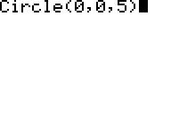

           
|Command Summary|Command Syntax|[Calculator Compatibility](compatibility.html)|[Token Size](tokens.html)|
|--- |--- |--- |--- |
|Zooms to a square window.|ZSquare|TI-83/84/+/SE|1 byte|

### Menu Location
Press:
1. ZOOM to access the zoom menu.
2. 5 to select ZSquare, or use arrows and ENTER.
       
# The ZSquare Command

The ZSquare command changes the [window variables](system-variables.html#window) Xmin and Xmax, or Ymin and Ymax, so that ΔX=ΔY, preserving all other settings and the coordinate of the center of the screen. This ensures that a numerical distance on the graphscreen has the same physical length on the calculator display, no matter if it's vertical, horizontal, or diagonal. Probably the most obvious effect of this change is that circles (whether graphed with an equation or drawn with the [Circle(](circle.html) command) are actually circles and not ovals.

When determining which of Xmin and Xmax or Ymin and Ymax to change, the command picks the ones that would be increased, and not decreased. This way, the window can never get smaller.

Note that [ZDecimal](zdecimal.html), [ZInteger](zinteger.html), and to an extent [ZTrig](ztrig.html) already have the same proportions, and don't require a ZSquare command to follow them.

## Advanced Uses

ZSquare can be useful in setting up a [friendly window](friendly-window.html).

## Error Conditions

- **[ERR:INVALID](errors.html#invalid)** occurs if this command is used outside a program.

## Related Commands

- [ZDecimal](zdecimal.html)
- [ZInteger](zinteger.html)
- [ZStandard](zstandard.html)

## See Also

- [Friendly Graphing Windows](friendly-window.html)
